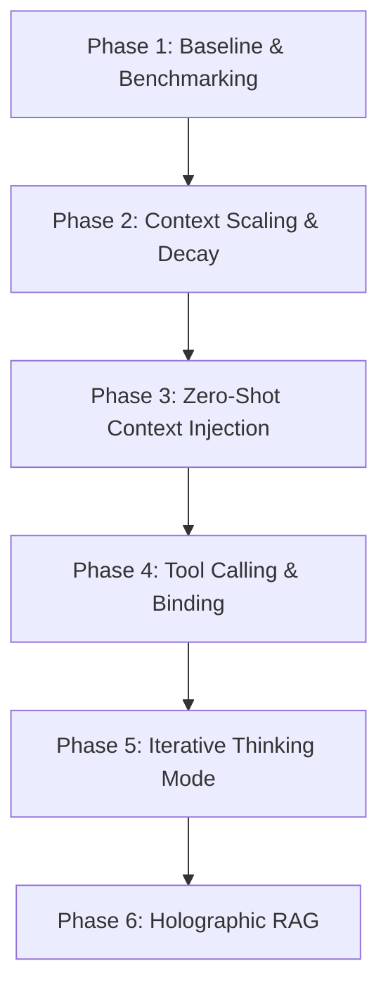

# CHFT Project Roadmap
*Complex Holographic/Hopfield Feature Representation (CHFT)*

> [!NOTE]
> Para un análisis profundo de la matemática cuántica de la versión 3 y las propuestas para la versión 4 y 5, consulta el documento principal: [CHFT_Paradigm_and_Roadmap.md](file:///i:/01-Master_Code/Test-Labs/01-CHFT/CHFT_Paradigm_and_Roadmap.md).

This roadmap details the progression phases for building, refining, and testing the CHFT model to surpass traditional LLM baselines, achieve massive scaling, and implement advanced features like dynamic memory injection, tool usage, reasoning ("thinking mode"), and holographic RAG retrieval.

---

## 🗺️ Phases Overview

---

## 📋 Detailed Phases

### Phase 1: Achieve and Surpass LLM Baseline Benchmarks
* **Goal**: Validate that the CHFT architecture can perform sequence prediction and language generation at or above standard Transformer attention baselines on equivalent parameters and data limits.
* **Tasks**:
  - [ ] Complete the training of the baseline model on the `TinyStories` dataset.
  - [ ] Compare validation loss, validation accuracy, and perplexity against a standard small Transformer model trained on the same data.
  - [ ] Tune hyperparameters (dimension $D$, learning rate, beta optimizer, and complex LayerNorm scaling).
  - [ ] Verify generated text diversity using Top-K sampling metrics.

---

### Phase 2: Expand Context Window (Towards Unlimited Context)
* **Goal**: Scale the context window beyond the current limit (`CONTEXT_LEN = 8`) to handle massive or virtually unlimited token streams without hitting the vector-superposition noise ceiling (crosstalk).
* **Tasks**:
  - [ ] Research and implement **Fractional Binding** or **Rotational Decay Operators** to exponentially decay older context tokens so they do not overpower recent ones in the active state $\psi$.
  - [ ] Evaluate **Segmented / Hierarchical Bundling**: Grouping contexts into blocks (e.g. sentences or paragraphs) and storing block vectors in a secondary key-value associative database rather than summing everything into one vector.
  - [ ] Benchmark context retrieval accuracy at lengths of 1,000, 10,000, and 100,000+ tokens to demonstrate scaling capabilities compared to commercial LLMs.

---

### Phase 3: Zero-Shot Dynamic Context Injection (No Retraining)
* **Goal**: Enable the model to learn new facts, guidelines, or conversation histories instantly by inserting new keys/values directly into the active Modern Hopfield Memory.
* **Tasks**:
  - [ ] Implement an API method to take raw text strings (e.g. "User name is Alice"), encode them via the FHRR Codebook, and append the resulting vectors to the Hopfield memory key-value weights matrix on the fly.
  - [ ] Test the model's ability to recall these newly added facts immediately in subsequent text generation cycles without running gradient descent.
  - [ ] Establish memory bounds and safety limits (analyzing at what capacity the Hopfield network experiences retrieval errors or hallucinations due to key density).

---

### Phase 4: Vector-Bound Tool Usage & Function Calling
* **Goal**: Empower the model to call external APIs, calculate math, or query databases by mapping semantic intent to execution triggers using Vector Symbolic Architecture (VSA).
* **Tasks**:
  - [ ] Define fixed vector representations for tools and bind them with trigger patterns using the VSA binding operator:
    $$\mathbf{v}_{trigger} = \mathbf{w}_{trigger\_keyword} \otimes \mathbf{t}_{tool}$$
  - [ ] Add these bound triggers directly into the Hopfield Memory.
  - [ ] Implement parameter extraction: Test decoding parameter values by applying the inverse binding operator ($\otimes \mathbf{t}_{tool}^{-1}$) to the query state $\psi$.
  - [ ] Build a runtime parser that intercepts tool-trigger vectors, executes the local code (e.g., calculator), and inserts the result back into the model's context vector.

---

### Phase 5: Iterative Reasoning ("Thinking Mode")
* **Goal**: Enable the model to perform multiple internal processing cycles (attractor updates) before producing a output token, mirroring the "thinking traces" of reasoning models.
* **Tasks**:
  - [ ] Implement a multi-step attractor trajectory loop in the Modern Hopfield Memory: allow the state vector $\psi$ to settle over $N$ iterations to clean up noise and converge on a logical concept.
  - [ ] Train the model on reasoning-chain data, encouraging the Hopfield dynamics to retrieve intermediate "scratchpad" vectors before selecting the final token probability vector.
  - [ ] Visualize and log the trajectory path of the context vector $\psi$ as it converges on the correct output representation.

---

### Phase 6: Holographic RAG Retrieval
* **Goal**: Perform Retrieval-Augmented Generation directly in the vector space by storing whole document index databases as bound holographic vectors.
* **Tasks**:
  - [ ] Build a database index where document chunks are encoded as high-dimensional holographic vectors.
  - [ ] Implement direct cosine-similarity matching between the active state vector $\psi$ and the holographic document database.
  - [ ] Retrieve relevant information at the hardware/tensor level without requiring standard text search pipelines, injecting retrieved information directly into the generation layer.
